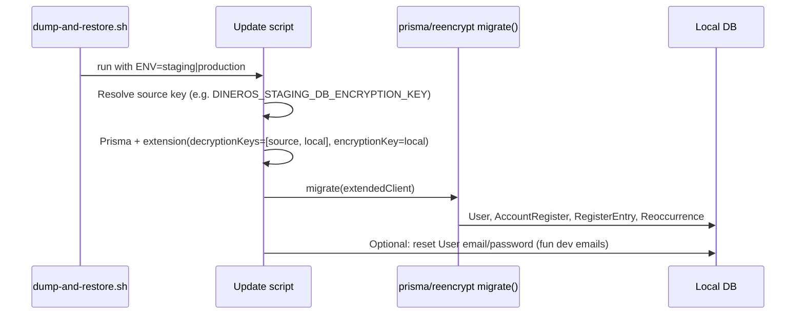

# Post-restore update script: auto-generated reencrypt

## Current state

- [scripts/dump-and-restore.sh](scripts/dump-and-restore.sh) runs `pnpm run reset-encrypted-users` after restore (calls [scripts/reset-encrypted-users-after-restore.ts](scripts/reset-encrypted-users-after-restore.ts)).
- The reset script uses a **single** key (local only), so it cannot decrypt data encrypted with staging/production. It therefore **overwrites** values: User email/password → dev@local.dev, raw SQL to null Plaid columns, then manual `AccountRegister.name` → `Register-{id}` and `RegisterEntry.description` → `Entry {id}`. **Reoccurrence is not updated.**
- [prisma/reencrypt/](prisma/reencrypt/) is **generated** by `prisma-field-encryption` and already implements migrate for **User, AccountRegister, RegisterEntry, Reoccurrence** (see [prisma/reencrypt/index.ts](prisma/reencrypt/index.ts)). The `Account` model has no encrypted fields in the schema, so "accounts" here means **account registers** (AccountRegister); no separate Account migrator exists.

## Goal

- Post-restore "update" step should update **register entries, account registers, recurrences, and user/emails**.
- All of these should be **auto-generated** (driven by the same generated reencrypt code so new encrypted models/fields are covered after `prisma generate`).
- Use **fun, common placeholder names** for overwrite fallback (and optional post–re-encrypt user reset) so local data feels recognizable.

## Fun common names (placeholders)

When overwriting with placeholders (fallback path or dev login reset), use these instead of generic "Register-{id}" / "Entry {id}":

| Entity | Field(s) | Fun common names (cycle by index) |
|--------|----------|-----------------------------------|
| **User** | email | `dev@local.dev` (first), then `alice@local.dev`, `bob@local.dev`, `charlie@local.dev`, `dana@local.dev`, … (fixed list; wrap with modulo). |
| **AccountRegister** | name | Cycle: `Main Checking`, `Savings`, `Credit Card`, `Cash`, `Venmo`, `PayPal`, `Investment`, `Loan`, `Mortgage`, `Side Hustle`, then `Register 11`, `Register 12`, … |
| **RegisterEntry** | description | Cycle: `Groceries`, `Coffee`, `Gas`, `Netflix`, `Rent`, `Salary`, `Transfer`, `Refund`, `Dining out`, `Utilities`, `Amazon`, `Spotify`, then `Entry 12`, `Entry 13`, … |
| **Reoccurrence** | description | Cycle: `Monthly rent`, `Weekly groceries`, `Netflix`, `Gym`, `Phone bill`, `Insurance`, `Subscription`, `Payday`, `Savings transfer`, `Loan payment`, then `Recurrence 11`, `Recurrence 12`, … |

- **User**: Keep first user as `dev@local.dev` for consistency; additional users get alice, bob, charlie, dana, etc.
- **AccountRegister / RegisterEntry / Reoccurrence**: Use a small array of friendly names and index by `id` or row order (e.g. `names[id % names.length]` or by iteration index). For high IDs, fall back to "Register N" / "Entry N" / "Recurrence N" to avoid repetition.

## Approach

Use the **generated** `migrate()` from `prisma/reencrypt` so the list of models and fields is never hand-maintained. Re-encryption requires being able to **decrypt** with the **source** env key and **encrypt** with the **local** key.

## Implementation

### 1. Post-restore script: re-encrypt path (auto-generated)

- **Input**: Restored env name (`staging` or `production`), e.g. from `dump-and-restore.sh` (already has `$ENV`).
- **Env**:
  - `DATABASE_URL`, `DB_ENCRYPTION_KEY` (local) — required.
  - Source key: `DINEROS_STAGING_DB_ENCRYPTION_KEY` or `DINEROS_PRODUCTION_DB_ENCRYPTION_KEY` (depending on restored env). If set, use **re-encrypt** path.
- **Logic**:
  - Build extended Prisma: `decryptionKeys: [sourceKey, localKey]`, `encryptionKey: localKey` (so existing ciphertext from source can be decrypted, then re-encrypted with local key).
  - Call `migrate(extendedClient, reportProgress)` from `~/prisma/reencrypt`. This updates **User, AccountRegister, RegisterEntry, Reoccurrence** in one go (auto-generated).
  - Then optionally reset User emails/passwords using **fun common names**: first user `dev@local.dev`, then `alice@local.dev`, `bob@local.dev`, etc. (same password: `RESTORE_DEV_PASSWORD` or `dev`).

### 2. Fallback when source key is not set

- If the source env encryption key is **not** set, keep a fallback so restore still results in a usable local DB:
  - Keep current behavior: raw SQL to null Plaid on `account_register` and `register_entry`; overwrite User (fun dev emails), AccountRegister and RegisterEntry with **fun common names** (see table above).
  - **Add Reoccurrence** to this fallback using the same **fun common names** list for descriptions (e.g. "Monthly rent", "Netflix", … then "Recurrence N").
  - Use the same extended client (local key only) and try/catch for missing table/column.

### 3. Wiring from dump-and-restore.sh

- Pass the env name to the script so it can choose the source key:
  - e.g. `pnpm run reset-encrypted-users -- staging` or an env var `RESTORE_FROM_ENV=staging` set by the shell before calling the script.
- Script reads `process.env.RESTORE_FROM_ENV` or the first positional arg (staging/production), then `DINEROS_${ENV}_DB_ENCRYPTION_KEY` (with ENV uppercased). If present, use re-encrypt path; else use fallback (with Reoccurrence + fun names).

### 4. Package.json and script name

- Keep `reset-encrypted-users` as the npm script name (or rename to something like `post-restore-encryption` if you prefer). Script file can stay `scripts/reset-encrypted-users-after-restore.ts` or be renamed for clarity; it will grow the re-encrypt path, add Reoccurrence to the fallback, and use the **fun common names** for all placeholders.

## Files to touch

| File | Change |
|------|--------|
| [scripts/reset-encrypted-users-after-restore.ts](scripts/reset-encrypted-users-after-restore.ts) | Resolve source key from env/arg; if set, create extended client with source+local keys, call `migrate()` from `~/prisma/reencrypt`, then reset User emails/passwords using **fun dev emails**. Else: keep current overwrite + null Plaid, **add** Reoccurrence, and use **fun common names** for AccountRegister, RegisterEntry, Reoccurrence (and User). |
| [scripts/dump-and-restore.sh](scripts/dump-and-restore.sh) | Before calling the npm script, export `RESTORE_FROM_ENV=$ENV` (or pass `$ENV` as argument if the script accepts args) so the script knows which source key to use. |

## Notes

- **Account**: No encrypted fields on the `Account` model; "accounts" is satisfied by **AccountRegister** (registers), which is already in the generated reencrypt.
- **Auto-generated**: The only way to keep everything auto-generated is to use `migrate()` from `prisma/reencrypt`; that list (User, AccountRegister, RegisterEntry, Reoccurrence) is generated from the schema and will grow if new encrypted models are added.
- **Security**: Source key should only be used in the post-restore script on the local DB; do not commit or log it. Document in script or README that for re-encryption the user must set e.g. `DINEROS_STAGING_DB_ENCRYPTION_KEY` when restoring from staging.
